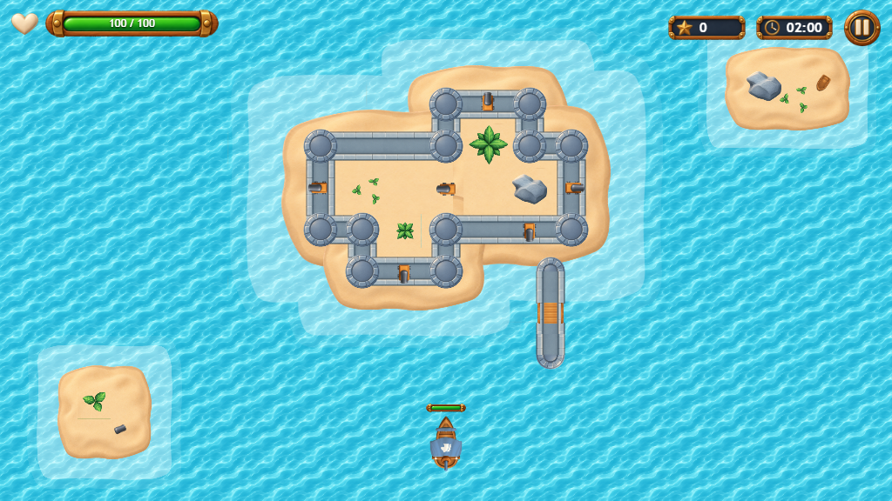

# Architecture

**Architecture** · [Differentiators](#differentiators)

Pirate Battle is a single-page app. React renders menus, forms, dialogs and the HUD. PixiJS renders the
arena, ships, projectiles and effects. The game rules are plain TypeScript with no Pixi or DOM dependency,
so they run headless in the unit tests.

```
src/
├── main.tsx, App.tsx      boot (starts MSW first), hash routes, pending-save sync, asset preloading
├── store.ts, settings.ts  observable store, validated options, player id, last result (localStorage)
├── game/
│   ├── config.ts          GAME_CONFIG and the per-match snapshot
│   ├── arena.ts           map layout, island spots, walls, colliders
│   ├── simulation.ts      rules: movement, AI, combat, spawns, islands, walls, end of match
│   ├── controller.ts      one match: Pixi app, ticker, fixed step, pause, HUD store
│   ├── renderer.ts        Pixi scene graph, interpolation, effects
│   └── input.ts, stick.ts, assets.ts, audio.ts, perf.ts
├── api/                   contracts, Axios client, TanStack Query layer, save queue
├── mocks/                 MSW handlers, fixtures, network scenarios
└── ui/                    React screens
```

## React and PixiJS

- `GameScreen` owns a host `<div>`. Its effect loads the assets, creates a `GameController`, awaits
  `init()` and only then stores it in state. A `cancelled` flag and a `disposed` check inside `init()` make
  it safe under React Strict Mode: every mount owns exactly one Pixi `Application`.
- The HUD is the only channel from the game to React. The controller writes a snapshot into a store read
  with `useSyncExternalStore`; the snapshot is replaced only when a displayed value changes (health,
  score, whole seconds left, phase, announcement). React renders about once per second, never per frame.
- React calls back with `pause()`, `resume()` and `input.setTouch()`. Positions, velocities and cooldowns
  live only in the simulation.

## Simulation cycle

- **Fixed step.** The ticker adds frame time to an accumulator and runs `step(1/60)`. Movement, damage,
  cooldowns, spawns and the match clock use simulation time, so 30 Hz and 144 Hz displays play the same
  match. Frame time is clamped to 100 ms. The renderer interpolates between the previous and current pose.
- **Events.** `step()` pushes events (shot, hit, wall-hit, island-moved, destroyed, score, ended). Each
  frame the controller drains them into the renderer, the audio player and the end-of-match hand-off. The
  simulation never calls out.
- **Determinism.** A seeded PRNG drives spawns and island moves: same seed and inputs, same match
  (`?seed=<n>`).
- **End and pause.** Time up or zero health ends the match and `step()` becomes a no-op; effects play for
  1.8 s, then the result screen opens. Pause (button, Esc/P, window blur, hidden tab, portrait phone)
  stops simulation and effects, clears held keys and resets the accumulator.

## Collisions

- **Islands.** Rounded rectangles with a signed distance field, for ships only. Cannonballs fly over
  islands. Edge islands move during a match: see [Differentiators](#differentiators).
- **Hulls.** A ship is a capsule of three circles (bow, centre, stern). A move that would collide falls
  back to its X-only or Y-only part (sliding along the shore); turns into an obstacle are refused. The
  simulation never enters a blocked pose.
- **Ship vs ship.** The deepest overlapping pair pushes both hulls apart. A Chaser that touches the player
  rams instead: it explodes, deals damage and does not score.
- **Projectiles.** Each step a ball moves, then is tested against arena limits, intact walls and its
  target (player balls test enemies, enemy balls test the player). A ball hits once and is consumed, so a
  kill scores once. The fastest ball moves 8.7 units per step, below the smallest target reach, so no swept
  test is needed (it would be above ~1,000 u/s).
- **Walls.** Stone rectangles that absorb one ball and break; towers never break:
  [Differentiators](#differentiators).

## Enemy AI and spawning

- **Navigation.** A grid of 32-unit cells over the match bounds; a breadth-first search from the player's cell gives each
  water cell its distance to the player (recomputed when the player changes cell, or when islands move).
  Enemies with a clear corridor go straight; the others follow the neighbouring cell closest to the player.
- **Chaser** closes in and rams. **Shooter** closes to attack range, stops at hold range and fires its bow
  cannon when aligned.
- **Spawns** come every interval from the Options (the first after min(2 s, interval)). They are deferred,
  not dropped, while 10 enemies are alive. The first two are always a Chaser then a Shooter, then a seeded
  55 / 45 pick. Spawn points are water cells near the border at least 420 units from the player.

## Resource management

- **Textures.** Loaded once with `Assets.load` (with progress), parsed into spritesheets and kept in the
  cache between matches. A failure shows an error and *Retry* (the loader drops failed entries, so Retry
  downloads again). The 2x UI atlas is used from a device pixel ratio of 1.5.
- **Code.** The game screen and PixiJS are a lazy chunk; if the download fails an error boundary retries
  with a fresh `lazy()`.
- **Per match.** Each match gets its own `Application` and WebGL context. `init()` renders once before the
  clock starts, so shader compilation stays behind the loading panel. Cannonball sprites are pooled;
  per-ship health textures are destroyed with their ship.
- **Teardown.** `destroy()` removes the keyboard, blur, visibility and density listeners and the ticker
  callback, destroys the scene and the application, and loses the WebGL context. Leaving, Restart and Play
  Again all take this path. PERFORMANCE.md has the 5- and 12-cycle memory checks.
- **Canvas.** Sized to its host with a resolution of `min(devicePixelRatio, 2)`. Each match gets arena
  bounds with the screen's aspect ratio (4:3 to 2.4:1), adding sea around the 1280 x 768 layout.

## Local persistence

Screens are hash routes (`#/`, `#/options`, `#/play`, `#/result`, `#/log/ranking`, `#/log/history`), so
reload and back work on any static host. Reloading during a match returns to the menu, except when a
finished match still waits for its ranking name.

| localStorage key | Content |
| --- | --- |
| `pirate-battle:settings` | Options (validated on read, defaults on invalid data) |
| `pirate-battle:player` | Local player id (UUID) |
| `pirate-battle:last-result` | Last finished match and whether its ranking-name step was answered |
| `pirate-battle:pending-matches` | Matches the server has not confirmed yet |
| `pirate-battle:mock-db` | Matches confirmed by the mock server |
| `pirate-battle:mock-scenario` | Selected network scenario and latency seed |

A match uses a frozen copy of the options taken at its start. An abandoned match (leaving, Restart,
reload) is never registered. Storage access is wrapped, so a blocked localStorage degrades to defaults.

## Ranking and history integration

- **Contracts** (`api/contracts.ts`, shared with the mocks):
  - `GET /api/ranking?sessionSeconds&spawnIntervalSeconds&page&pageSize` returns `Page<RankingEntry>`.
  - `GET /api/players/:playerId/matches?page&pageSize` returns `Page<MatchRecord>`, newest first.
  - `PUT /api/matches/:matchId` with a `MatchRecord`: 201 when created, 200 with the stored record when
    the id already exists.
  - A `MatchRecord` carries match and player ids, end time, score, duration, end reason, the options,
    `ranked` and `playerName` (2–16 characters, validated on both sides). `isMatchRecord` also checks
    the date, the option ranges and that the duration fits the session.
- **Ranking order.** Only `ranked` matches with the same session time and spawn interval compete. Order:
  score desc, longer survival, earlier `playedAt`, `matchId`.
- **Cache** (TanStack Query). Keys `['ranking', session, spawn, page]` and `['history', playerId, page]`.
  `staleTime` 10 s, `keepPreviousData` while paging, `refetchOnMount: 'always'` (cached rows stay visible
  with *Updating…*). Retries: 2, only for timeouts, network errors, 5xx and 429, with exponential delay.
  Every request gets the query's `AbortSignal`, and a late answer lands only in its own page's cache entry,
  so it cannot overwrite newer data.
- **Idempotent registration.** `matchId` is a client UUID and PUT on an existing id returns the stored
  record, so retries after a timeout or double clicks never duplicate. `submitOnce` also shares one
  in-flight request per match.
- **Pending records and recovery.**
  1. When a match ends it is written to `last-result`, unconfirmed. *Continue* fixes `ranked` and
     `playerName` and moves it to `pending-matches` before any network call. A reload before *Continue*
     returns to the result screen.
  2. `usePendingSync` submits pending records on start-up (recovery after reload), when one is added,
     every 20 s and on the browser `online` event.
  3. The mutation retries retryable errors 3 times. On success the record leaves the queue and both
     queries are invalidated. A permanent 4xx keeps the record on the device, and only *Retry now* or a
     reload tries it again.
  4. The result screen and Match History derive *Saved / Saving / Not saved yet* from the queue and the
     mutation state.
- **Isolation.** The game never awaits the API: a failing API only affects the two tabs and the save status.
- **Mocks.** `mocks/handlers.ts` implements the contracts and runs in development, in the published build
  and in tests (`msw/vite` in `worker-only` mode emits `mockServiceWorker.js`). Fixtures come from a fixed
  seed; the scenarios and their reset are in the README.

## Accessibility and mobile

- Native `<dialog>` for pause, tutorial and network panel (focus trap, Esc, focus return); focus moves to
  the heading on every screen; ARIA tabs, `meter` for health and a polite live region for pause, low
  health, time warnings and island moves.
- `prefers-reduced-motion` disables camera shake and UI animation.
- Gameplay is landscape-only on phones (portrait pauses and asks to rotate). Touch controls are six
  hold-to-act buttons with pointer capture, so several fingers work at once, plus a floating stick.
  Fullscreen is optional and never entered automatically.
- No screen scrolls: compact CSS layouts plus an automatic fit (`useFitScreens`) that zooms a screen down
  just enough to fit the window.

## Testing

- `npm run test:unit`: the rules on Node's test runner, headless (collisions, damage, scoring, spawns,
  walls, islands, determinism).
- `npm run test:e2e`: Playwright, desktop and mobile projects, one fresh browser context per test. Game
  tests freeze `page.clock` and advance the real simulation through `window.__pirateBattle.advance()`
  (`?debug`). Network specs keep the real clock because the Axios timeout is the browser's own.

## Balancing decisions

All values are in `GAME_CONFIG` (`src/game/config.ts`).

| Parameter | Value | Why |
| --- | --- | --- |
| Arena | 20 x 12 tile layout (1280 x 768) plus sea to the screen's ratio | Readable ships, no empty borders |
| Player | 100 hp, 140 u/s, 2.4 rad/s | Outruns both enemies; turning is the main dodge |
| Bow cannon | 25 dmg, 0.35 s, range 460 | Reliable answer to Chasers (one hit sinks them) |
| Broadside | 3 x 20 dmg, 1.2 s per side, range 320 | Higher burst for close fights, rewards positioning |
| Chaser | 25 hp, 100 u/s, ram 20 | Dangerous in groups, dies to one aimed shot |
| Shooter | 50 hp, 80 u/s, 6 dmg every 2.5 s, attack 360, hold 260 | Tanky but slow and unaimed, so a moving player dodges |
| Spawning | Interval from Options (1–10 s, default 3), max 10 alive, at least 420 units away | Constant pressure without unavoidable damage |
| Mix | Chaser then Shooter, then 55 % / 45 % | Both kinds in every match |
| Edge islands | Resurface every 30 s (`arena.ts`) | Keeps the lanes changing without a new option |

Spawn distance 420 is beyond the Shooter's attack range (360) and gives a Chaser four seconds of travel, so
a fresh spawn never deals unavoidable damage.

## Known limitations

- **Hull shape.** Hulls are capsules; sails overhang them, so a ship can visually brush an island first.
- **Bunching.** Enemies share one flow field and can bunch up near the player; push-apart keeps them from
  overlapping.
- **Sound.** The sounds are uncompressed WAV (5.8 MB), downloaded in the background after the textures.
  Browsers allow decoding only after the first click, so on a slow connection the first sounds of the first
  match can be missing.
- **Local-only data.** The mock server stores data in each browser's localStorage; the player identity is
  local and the ranking name is not remembered between matches.
- **E2E speed.** Headless Chromium renders WebGL in software (35–100 ms per frame), so the suite advances
  long matches through the time hook instead of real frames. Visual baselines are per operating system.
- **Profiling.** The logs in `profiling/` come from the previous map (see PERFORMANCE.md).

---

# Differentiators

**[Architecture](#architecture)** · Differentiators

| | |
| --- | --- |
| **Document** | Differentiators of Pirate Battle |
| **Subject** | Resurfacing edge islands and destructible fortress walls |
| **Related files** | `src/game/arena.ts`, `src/game/simulation.ts`, `src/game/renderer.ts`, `src/game/simulation.check.ts` |



## 1. Purpose

This section documents the two mechanics that set the game apart from a static arena: the edge islands,
which resurface at a new position at a fixed interval, and the walls of the central fortress, which are
destroyed by cannonballs. Both change the playable space during a match, so no two moments of a battle
offer the same cover and the same firing lanes.

## 2. Scope

The section covers the rules, the configuration and the implementation of both mechanics, and how to verify
them. It does not cover ship combat, enemy behaviour or the ranking, which are described in the
Architecture section.

## 3. Resurfacing edge islands

### 3.1 Description

Two islands lie at the edge of the sea. At a fixed interval of the match clock, `ISLAND_SHIFT_SECONDS`
(30 s by default), each island sinks and resurfaces at another spot. The first move happens 30 s after the
match starts, and then every 30 s.

### 3.2 Rules

1. There are six spots: the four corners and the middle of the left and right sides. They follow the
   bounds of the match, so on wide screens they sit at the real edge of the screen.
2. At the start of a match the islands occupy spots 1 and 2 (top right and bottom left).
3. Each island moves to a spot that no island occupies. The choice is random, drawn from the match PRNG:
   with the same seed, the same sequence of moves repeats.
4. A spot is eligible only if the hull of every ship afloat, the player's or an enemy's, clears the island
   that would appear there by at least 12 units. An island never surfaces on a ship.
5. If no spot is eligible, the island stays where it is until the next interval.
6. Islands block ships. Cannonballs fly over them.

### 3.3 Implementation

- `Simulation.shiftIslands()` applies the rules above. It runs from `step()` when the island timer expires,
  then rebuilds the colliders and the navigation grid at once, so ships and enemy pathfinding see the new
  layout in the same step. Enemy spawn points are filtered by the islands at the moment of each spawn.
- The simulation emits an `island-moved` event. The renderer shows foam rings at the old and the new spot
  and fades the island back in over one second. The controller plays a splash sound and announces the move
  to screen readers.

## 4. Destructible fortress walls

### 4.1 Description

The central island is surrounded by a fortress of 22 wall segments: 10 breakable walls (straight walls,
walls carrying a cannon and the two stone ends of the jetty) and 12 towers.

### 4.2 Rules

1. A cannonball that touches an intact wall is consumed and does no damage to the ships behind it. The
   wall breaks and stays broken until the match ends.
2. Later cannonballs pass through the gap.
3. A tower stops every cannonball and never breaks.
4. The rules apply to every shot, the player's and the enemies' alike.
5. Walls are not rebuilt during a match. Restart and Play Again create a new simulation, with all walls
   intact.

### 4.3 Implementation

- `WALLS` (`arena.ts`) is generated from the fortress layout. Each entry has a stone rectangle for the
  hit test and the sprite shown once broken (frames 88 to 91); towers have none.
- `Simulation.updateProjectiles()` tests each ball against the intact walls before testing ships, and
  records the break in `wallBroken`. It emits a `wall-hit` event with a `broken` flag.
- The renderer swaps the sprite for the broken variant and adds stone debris, a shock ring and an
  explosion. The controller plays a crumbling sound for a wall and a dull thud for a tower.

## 5. Configuration

| Parameter | Location | Value |
| --- | --- | --- |
| Interval between island moves | `ISLAND_SHIFT_SECONDS`, `src/game/arena.ts` | 30 s |
| Island spots | `islandSpots()`, `src/game/arena.ts` | 6 |
| Starting spot of each island | `PERIPHERALS[].slot`, `src/game/arena.ts` | 1 and 2 |
| Clearance to ships | `shiftIslands()`, `src/game/simulation.ts` | 12 units |
| Walls, towers and broken sprites | `FORT_ROWS`, `JETTY`, `WALLS`, `src/game/arena.ts` | 10 + 12 |

The interval is a code constant, not an option on the Options screen, so the ranking contract (a league is
defined by session time and spawn interval) is unchanged.

## 6. Effect on gameplay

- The fortress offers cover, but each breakable wall protects only once. Both the player and the enemies
  open lanes by shooting, so a position that was safe stops being safe.
- Every 30 s the free lanes along the edges change: a corner that was an obstacle becomes open water and
  the opposite one closes. Ships near the edges must re-route, and enemies recompute their route.

## 7. Verification

Automated, with `npm run test:unit` (`src/game/simulation.check.ts`):

| Test | What it proves |
| --- | --- |
| balls fly over islands; each fortress wall stops one ball, then breaks | The first ball breaks the near wall, the second the far wall, the third crosses the island |
| towers stop every ball and never break | Two balls on a tower, both absorbed, nothing broken |
| peripheral islands resurface at another free slot, never on a ship | Every island moves after the interval to a different spot; with ships parked on spots, 20 consecutive moves never land on one |

Manual: open `/?seed=7&debug`. Fire at a wall of the fortress: it breaks on the first hit and the next
balls pass. In the browser console, `__pirateBattle.advance(30)` runs 30 s of the real simulation at once
and triggers the first island move.

## 8. Limitations

- Islands move only between the six fixed spots; there is no free placement.
- Broken walls are not rebuilt within a match, so the fortress offers less cover as the match goes on.
- The interval is not adjustable from the interface.
- The E2E suite does not cover these two mechanics; they are covered by the unit tests.
