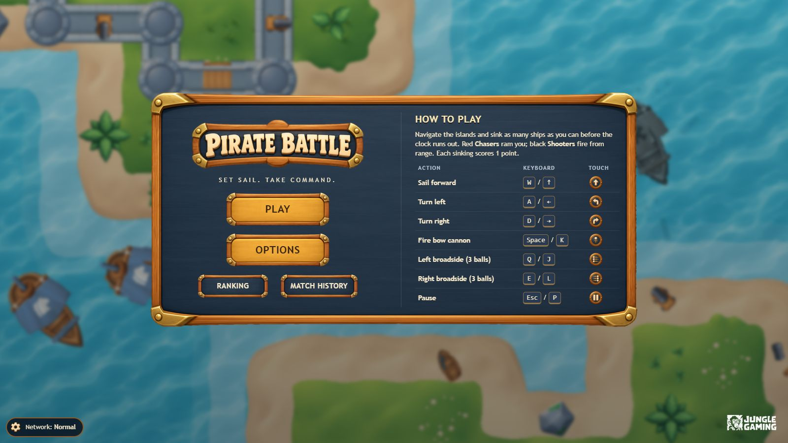
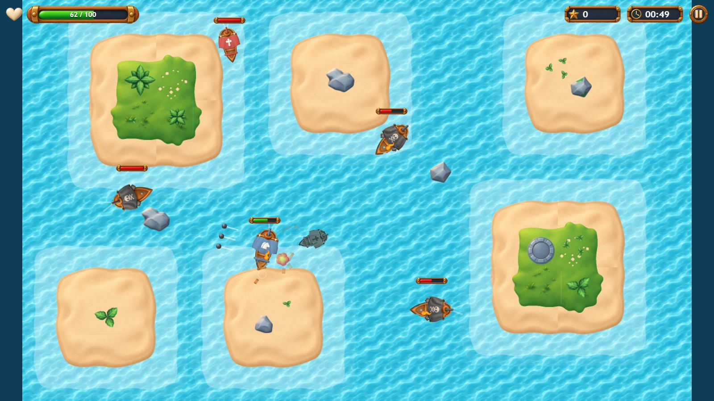
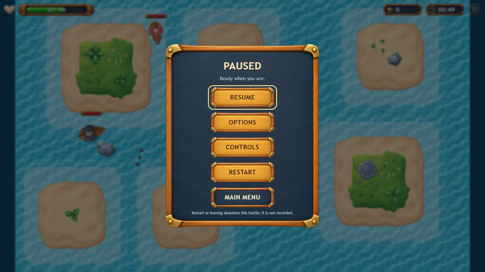
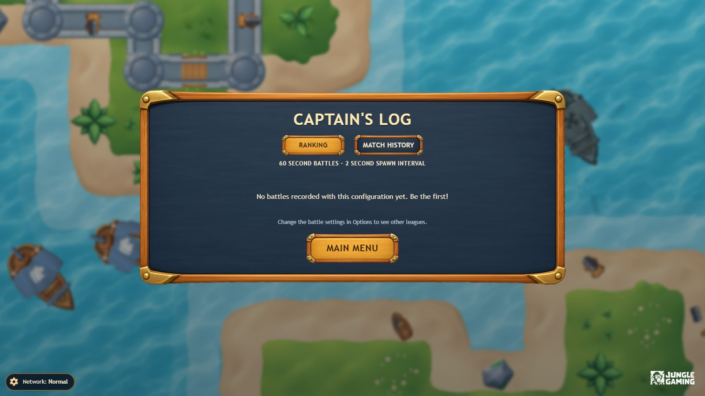

# Pirate Battle

A top-down naval shooter for the browser. Sail between islands, sink Chasers and Shooters, and climb the
ranking before the clock runs out.

Built with **React 19**, **TypeScript (strict)**, **PixiJS 8**, **TanStack Query 5**, **Axios** and
**MSW 3**, bundled with Vite.

| Menu | Battle |
| --- | --- |
|  |  |
|  |  |

- [ARCHITECTURE.md](ARCHITECTURE.md): React/Pixi integration, simulation loop, collisions, resources,
  persistence, ranking and history integration, balancing decisions and limitations.
- [PERFORMANCE.md](PERFORMANCE.md): profiling method and results.
- [CREDITS.md](CREDITS.md): asset sources and licenses.

## Quick start

Requires Node.js 22.12 or newer.

```bash
npm ci
npm run dev        # http://localhost:5173
```

No backend is needed: the ranking and match history API is mocked by MSW in development and in the
published build.

## Commands

| Command | What it does |
| --- | --- |
| `npm run dev` | Development server with hot reload |
| `npm run build` | Type check (`tsc -b`) and optimized production build in `dist/` |
| `npm run preview` | Serves `dist/` at http://localhost:4173 |
| `npm run lint` | ESLint (TypeScript, React Hooks rules) |
| `npm run typecheck` | TypeScript project check, no output files |
| `npm run test:unit` | Headless checks of the game rules (`src/game/simulation.check.ts`) |
| `npm run test:e2e` | Playwright E2E suite on Chromium, desktop and mobile (builds and serves the bundle itself) |
| `npm run test:e2e:report` | Opens the HTML report of the last run (failed tests carry their trace) |
| `npm run test:e2e:update` | Regenerates the visual-regression baselines |
| `npm run profile` | Profiling harness behind [PERFORMANCE.md](PERFORMANCE.md); needs Chrome and `npm run preview` running |

## End-to-end tests

```bash
npx playwright install chromium   # once
npm run test:e2e                  # both projects; HTML report in playwright-report/
npm run test:e2e:report           # open it; failures keep a trace (also: npx playwright show-trace <trace.zip>)
```

- **Projects.** `desktop` (Chromium, 1024 x 576) and `mobile` (Chromium as a Pixel 7 in landscape, touch
  input). Every spec runs on both; touch-only and desktop-only checks skip on the other one.
- **Isolation.** Each test gets a fresh browser context: empty localStorage, its own MSW service worker.
  Anything a test needs is seeded through `addInitScript` (options, player id, a finished battle).
- **Reproducibility.** Game tests freeze the page clock before the app loads (`page.clock`), so the Pixi
  ticker, timers and `Date` only move when the test pushes them. Battles run on the real simulation through
  the `?debug` handle (`window.__pirateBattle`): `state()` observes and `advance(seconds)` feeds whole fixed
  steps with the keys (or touches) really held down, without drawing between steps. `?seed=<n>` fixes the
  spawns and `?scenario=<id>` the network behaviour. Real frames still go through the real ticker and
  renderer wherever that is the behaviour under test (pause, the end-of-match hand-off, screenshots).
- **Network tests** (`ranking-history`, `registration`) use the real clock, because the Axios timeout is the
  browser's own and cannot be fast-forwarded.
- **Visual regression.** `visual.spec.ts` compares the menu, a fresh arena and the result screen with the
  baselines in `e2e/visual.spec.ts-snapshots/`, one set per project and operating system (the committed ones
  come from Windows). On another OS, run `npm run test:e2e:update` once to create yours.

| Spec | Covers |
| --- | --- |
| `options.spec.ts` | Navigation, validation, persistence, per-match snapshot of the options |
| `assets.spec.ts` | Loading state, texture and game-code failures, Retry |
| `movement.spec.ts` | Match start, sailing, rotation, arena limits, island collisions |
| `combat.spec.ts` | Bow and side shots, damage, cooldowns, scoring without duplication |
| `enemies.spec.ts` | Chaser and Shooter behaviour, spawn interval and spawn points |
| `match-end.spec.ts` | End by time and by death, frozen simulation, clean restart |
| `pause.spec.ts` | Manual pause, focus loss, hidden tab, resume without clock jumps |
| `result.spec.ts` | Result screen content and persistence across refreshes |
| `flow.spec.ts` | Abandoning a battle, repeated navigation, touch controls, portrait phone |
| `ranking-history.spec.ts` | Both tabs: loading, empty, error, pagination |
| `registration.spec.ts` | Registering a match, pending saves after refresh, no duplicates, late answers |
| `visual.spec.ts` | Visual regression |

## Environment variables

All optional; copy `.env.example` to `.env` to override.

| Variable | Default | Purpose |
| --- | --- | --- |
| `VITE_API_BASE_URL` | empty (same origin) | Base URL of the ranking/history API |
| `VITE_API_TIMEOUT_MS` | `5000` | Client timeout for API calls |
| `VITE_ENABLE_MOCKS` | `true` | `false` disables MSW, for example to test against a real backend |

## Controls

| Action | Keyboard | Touch |
| --- | --- | --- |
| Sail forward | `W` / `↑` | ⬆ button (left cluster) |
| Turn left / right | `A` / `←`, `D` / `→` | ↶ ↷ buttons (left cluster) |
| Bow cannon (1 ball) | `Space` / `K` | Bow button (right cluster) |
| Left broadside (3 balls) | `Q` / `J` | Left broadside button (right cluster) |
| Right broadside (3 balls) | `E` / `L` | Right broadside button (right cluster) |
| Pause | `Esc` / `P` | Pause button (top right) |

You can sail, turn and fire at the same time, with several keys or fingers. The same table appears on the
main menu and in the pause menu, showing only the column that applies to your device: Touch on phones and
tablets, Keyboard on computers (both on laptops with a touch screen). Touch controls show on touch
devices; on phones the game is played in landscape, and held upright it pauses and asks you to rotate the
phone (only Options, Controls and Main Menu stay available until you do).

No screen scrolls, at any window size: layouts get compact on short and narrow screens and, if anything
still sticks out of the window, the whole screen is scaled down until it fits.

On phones, tablets and small windows the main menu fits the screen without scrolling: *How to play*
becomes a button that opens the tutorial, with the touch buttons shown large.

The map fills the whole screen: the arena adapts to the screen shape when each match starts (more sea at
the sides on wide screens). On phones and tablets fullscreen is optional: the button at the bottom right
of the main menu (and the one in the HUD during a match) enters landscape fullscreen without the browser
bars, and leaves it. The game never enters it on its own. iPhone Safari has no page fullscreen; added to
the Home Screen, the game opens without the bars.

The match also pauses on its own when the window loses focus or the tab is hidden. Resuming always takes
an explicit action (Resume button or `Esc`).

## Rules in short

- One point per enemy sunk by your cannons. A Chaser that rams you explodes and does not score.
- **Chasers** (red sails) hunt you down and ram; one bow shot sinks them.
- **Shooters** (black sails) close in to firing range and shoot from the bow.
- Islands block ships, but cannonballs fly over them (they do not stop on the sand).
- The central island, an irregular cross shape, is surrounded by walls and has a stone jetty: each wall
  stops **one** ball and breaks, letting later shots through; towers stop every ball and never break.
  This applies to your shots and to the enemies'.
- Every 30 s the two edge islands sink and reappear in another free corner or side, chosen at random;
  never on top of a ship.
- Each sunk ship drops 1 or 2 crew members into the water, who go under inside a closing circle, and
  leaves wreckage that slowly sinks.
- The match ends when time runs out or your ship sinks. Leaving the battle (menu, Restart, reload)
  abandons it: abandoned matches are not recorded.

## Gameplay configuration

**Options screen** (saved in localStorage, survives refresh):

| Option | Range | Default |
| --- | --- | --- |
| Game session time | 60–180 s, whole seconds | 120 s |
| Enemy spawn time | 1–10 s, up to one decimal | 3 s |
| Sound effects | on / off | on |

Each match takes a snapshot of the options when it starts. Changes made from the pause menu apply to the
next match.

**Balancing:** every other gameplay number is in `GAME_CONFIG` (`src/game/config.ts`). That covers
spawn timing and mix, hit points, speeds, turn rates, hull sizes, damage, projectile speed and range,
cooldowns, and the Shooter's attack and hold ranges. Systems only read this config, so rebalancing never
touches their code. The chosen values and their rationale are listed in
[ARCHITECTURE.md](ARCHITECTURE.md#balancing-decisions).

## Ranking and match history

Open **Ranking** or **Match History** from the main menu (both live in the *Captain's Log*).

- **Ranking name (optional).** When a battle ends, the result screen asks for a captain name (2–16
  characters) before *Continue*. With a name, the battle enters the ranking under that name. If you press
  *Continue* with the field empty, it stays out of the ranking: it is saved to Match History only, and
  the screen says so before you continue.
- **Ranking** compares named matches played with your current Options (session time + spawn interval).
  Ties are broken by survival time, then by who set the score first.
- **Match History** lists all your battles, newest first, with the name used in the ranking (or *Not
  ranked*). Matches waiting to be saved are listed above it, with a *Retry now* button.
- Every finished match is saved exactly once, after *Continue*. Until then it waits on the result screen,
  even across a reload. After *Continue* it is kept on the device until the server confirms it, including
  across reloads and failures.
- You can always start another battle while a save is pending.

## Network scenarios (MSW)

On any menu screen, the **Network** button (bottom left) opens the scenario panel. You can also pass the
scenario in the URL, for example `/?scenario=slow&seed=7`. The choice persists across reloads.

| Scenario (`id`) | Behaviour |
| --- | --- |
| Normal (`normal`) | Success, 120–380 ms seeded latency |
| Empty lists (`empty`) | Ranking and history return no rows |
| Many pages (`many-pages`) | 60 extra fixture matches per league |
| Slow network (`slow`) | 2.5–3.5 s per request |
| Variable latency (`variable-latency`) | 0.1–2.5 s, seeded; answers can arrive out of order |
| Out of order (`out-of-order`) | Alternates 2.2 s and 0.2 s, so older requests finish last |
| Timeout (`timeout`) | Requests answer after the client timeout |
| Connection failure (`network-error`) | Every request fails at the network level |
| HTTP 500 (`server-error`) | Every request answers 500 (retried) |
| HTTP 400 (`client-error`) | Every request answers 400 (not retried) |
| Ranking fails (`ranking-down`) | Only the ranking query answers 503 |
| History fails (`history-down`) | Only the history query answers 503 |
| Timeout after save (`submit-timeout`) | The first save of each match is stored but answers too late |
| Saving unavailable (`submit-unavailable`) | Saves answer 503 until you switch back |

**Latency seed:** latency jitter comes from a seeded generator. Change *Latency seed* in the panel, or
pass `seed=` in the URL, to replay a run exactly.

**Reset to initial state** (in the panel) does all of the following:

- deletes saved matches (only the fixtures remain);
- clears pending saves, the last result and the query cache;
- restores the Normal scenario and the default seed.

### Reproducing failures

Set **Game session time** to 60 s in Options to finish matches quickly.

- **Ranking or history query fails:** choose *Ranking fails* (or *History fails*), then open the
  Captain's Log. The failing tab shows the error and a *Retry* button; the other tab keeps working.
- **Loading and background refresh:** choose *Slow network*. The first visit shows *Loading…*. Switch
  tabs and come back: the cached rows stay visible with *Updating…* while the data refreshes.
- **Late answers never overwrite newer data:** choose *Out of order* and press *Next page* twice quickly.
  The list ends on page 3 with page 3's rows.
- **Timeout after a save, no duplicates:** choose *Timeout after save*, finish a match and press
  *Continue*. The result screen shows *Saving to the Captain's Log… (attempt 2)* and then *Saved to the
  Captain's Log*. Match History lists the match once.
- **API down when the match ends, saved after recovery:**
  1. Choose *Saving unavailable*, finish a match and press *Continue*. The result screen shows *Not
     saved yet* and a *Retry now* button.
  2. Reload the page. Match History still lists the match as waiting to be saved.
  3. Switch back to *Normal*, then press *Retry now* or wait up to 20 s. The match is saved and both
     tabs update.
- **Asset loading failure:** in DevTools → Network → *Request blocking*, block `*tiles_sheet*` and reload.
  Press *Play*: the loading panel reports the failure and offers *Retry*. Unblock the request and press
  *Retry*.
- **Pause on focus loss:** during a match, switch tabs or click outside the window. The game pauses;
  timer, cooldowns and enemies stay frozen until you press *Resume*.

## Debug and profiling flags

| URL parameter | Effect |
| --- | --- |
| `?seed=<n>` | Fixes the match seed (spawn kinds and positions replay identically) |
| `?debug` | Draws island and wall colliders over the map |
| `?perf` | Shows an FPS / frame-time / entity overlay; logs a report at the end of each match |
| `?debug` or `?perf` | Also exposes `window.__pirateBattle`: a read-only `state()` snapshot and `advance(seconds)`, a test hook that steps the real simulation without drawing between steps |

## Deployment

Any static host works, at the domain root or under a sub-path (the build uses relative URLs). The app uses
hash routes, so no rewrite rules are needed.

| Setting (Vercel) | Value |
| --- | --- |
| Framework preset | Vite |
| Build command | `npm run build` |
| Output directory | `dist` |

The build includes `mockServiceWorker.js`, so the published site runs the mocked API. Service workers
need HTTPS (or `localhost`); on a plain-HTTP address the game still runs, but the two API tabs show
errors.

## Project structure

```
src/
├── game/        rules (simulation), Pixi renderer, controller, input, audio, assets, config
├── api/         contracts, Axios client, TanStack Query hooks and the save queue
├── mocks/       MSW handlers, fixtures and network scenarios
├── ui/          React screens (menu, options, game, result, captain's log, network panel)
├── App.tsx      routes, pending-save sync, asset preloading
└── main.tsx     starts the mocks, then renders the app
e2e/             Playwright specs, shared helpers and visual baselines
assets/          art, atlases and sounds supplied with the challenge
```
